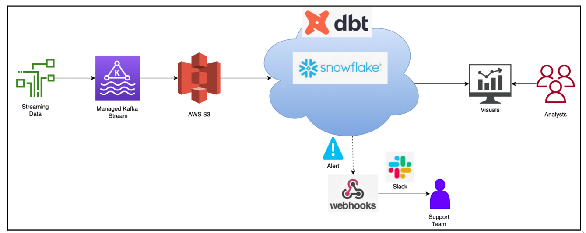

# Stock_Streaming_Pipeline

The main objective of this project series is to offer a complete comprehension of the
Data Build Tool (DBT).Furthermore, to ensure efficient monitoring of
each pipeline run, there is an incorporated Slack and email notifications using SNS (Simple
Notification Service). This project aims to construct a comprehensive Streaming Pipeline using the
capabilities of DBT Cloud, Snowflake, and Amazon Kinesis to handle and process Stock
Market Data. The project's objectives encompass various pivotal tasks, including setting
up the DBT configuration within a cloud-based environment. It involves the creation of a
dynamic data ingestion pipeline seamlessly integrated with a streaming data source,
specifically Amazon Kinesis Firehose. 

The ingested data is then directed to a Raw
Ingestion Layer hosted on Amazon S3, with data extraction from the yfinance library
accomplished through Python code. The project also involves crafting a robust data
transformation and consumption layer utilizing DBT Cloud's advanced features. The
orchestration of the DBT pipeline within the DBT Cloud ecosystem ensures efficient
execution, while the project's scope extends to streamlining Git merging and pipeline
execution within the DBT Cloud environment. Additionally, the integration of alerting and
notification functionalities provided by DBT Cloud enhances the project's overall
functionality. In summary, this project strives to harmonize these technologies, resulting
in a proficient Streaming Pipeline for real-time processing, transformation, and analysis
of Stock Market Data.

## Tech Stack
* Language: Python, SQL
## Tools
* dbt Cloud
## Databases
* Snowflake
## Cloud Services:
* AWS EC2
* Amazon Kinesis Firehose
* AWS S3